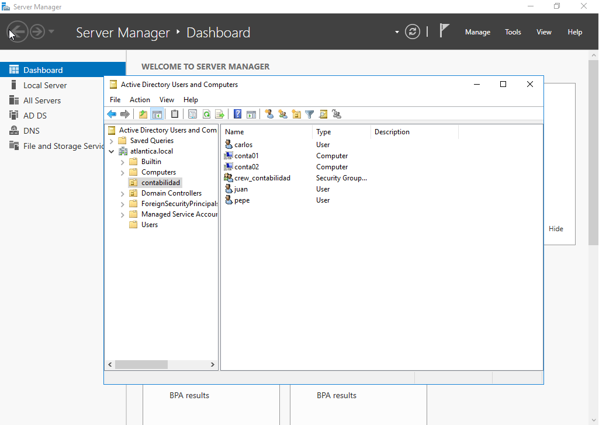

# Adición de Ubuntu Desktop a dominio Active Directory


Partimos de la structura de Active Directory de la ilustración.

<figure><figcaption><p>Detalle de la organización ficticia de Atláántica Shipping Company.</p></figcaption></figure>

Nos fijamos en el nombre completo que debe tener la máquina conta01: conta01.atlantica.local.

Configuramos /etc/hosts.

```
127.0.0.1	localhost.atlantica.local localhost
127.0.1.1	conta01.atlantica.local	conta01

# The following lines are desirable for IPv6 capable hosts
::1     ip6-localhost ip6-loopback
fe00::0 ip6-localnet
ff00::0 ip6-mcastprefix
ff02::1 ip6-allnodes
ff02::2 ip6-allrouters

```

Configuramos /etc/hostname.

```
conta01.atlantica.local
```

Configuramos /etc/resolv.conf. En el search debe aparecer el dominio del bosque y la IP del AD como DNS.

```
# This is /run/systemd/resolve/stub-resolv.conf managed by man:systemd-resolved(8).
# Do not edit.
#
# This file might be symlinked as /etc/resolv.conf. If you're looking at
# /etc/resolv.conf and seeing this text, you have followed the symlink.
#
# This is a dynamic resolv.conf file for connecting local clients to the
# internal DNS stub resolver of systemd-resolved. This file lists all
# configured search domains.
#
# Run "resolvectl status" to see details about the uplink DNS servers
# currently in use.
#
# Third party programs should typically not access this file directly, but only
# through the symlink at /etc/resolv.conf. To manage man:resolv.conf(5) in a
# different way, replace this symlink by a static file or a different symlink.
#
# See man:systemd-resolved.service(8) for details about the supported modes of
# operation for /etc/resolv.conf.

nameserver 127.0.0.53
options edns0 trust-ad
search atlantica.local
```

Instalamos los paquetes necesarios para agregar la máquina Ubuntu Desktop al dominio.&#x20;

```bash
$ sudo apt install realmd sssd oddjob oddjob-mkhomedir adcli samba-common
```

(Ver capturas)

Es necesario cambiar en /etc/sssd/sssd.conf la línea use\_fullt\_qualified\_names a False
