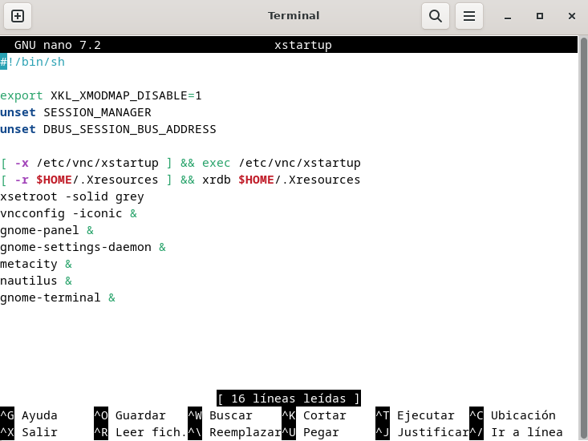
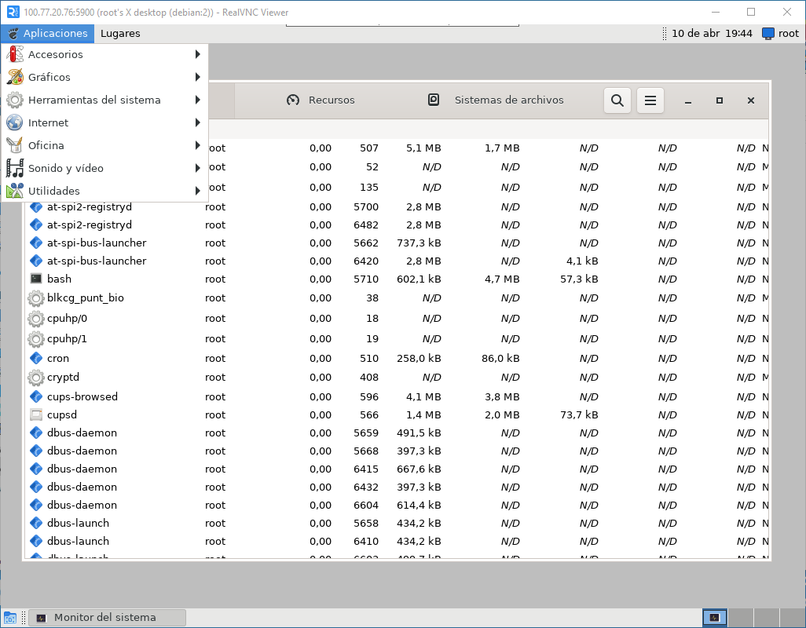

# UF4 Configuración de servidor VNC en Debian con escritorio GNOME.

Fecha: 9 de abril de 2024

Fuentes:

* [https://arnhost.com/billing/knowledgebase/91/How-to-Install-VNC-wor-GNOME-on-Debian-VPS.html?language=chinese](https://arnhost.com/billing/knowledgebase/91/How-to-Install-VNC-wor-GNOME-on-Debian-VPS.html?language=chinese)
* [https://askubuntu.com/questions/694795/how-to-start-vnc-session-with-gnome-desktop](https://askubuntu.com/questions/694795/how-to-start-vnc-session-with-gnome-desktop)
* [https://help.clouding.io/hc/es/articles/360010658340-C%C3%B3mo-instalar-y-configurar-VNC-Server-en-Linux](https://help.clouding.io/hc/es/articles/360010658340-C%C3%B3mo-instalar-y-configurar-VNC-Server-en-Linux)
* [https://stackoverflow.com/questions/42296329/how-to-properly-configure-xstartup-file-for-tightvnc-with-ubuntu-vps-gnome-envir](https://stackoverflow.com/questions/42296329/how-to-properly-configure-xstartup-file-for-tightvnc-with-ubuntu-vps-gnome-envir)

&#x20;

Actualizamos el sistema con la última versión de los paquetes.

```bash
# apt update
# apt upgrade
```

Instalamos las fuentes necesarias.

```bash
# apt install xfonts-100dpi
# apt install xfonts-100dpi-transcoded
# apt install xfonts-75dpi
# apt install xfonts-75dpi-transcoded
# apt install xfonts-base
```

Instalamos el servidor Tight VNC Server.

```bash
# apt install tightvncserver
```

Para copiar los archivos iniciales de configuración y establecer un password para la conexión al escritorio remoto ejecutamos por primera vez el servidor.

```bash
# tightvncserver :1
```

Como aún hemos de personalizar la configuración, paramos el servidor.

```bash
# tightvncserver -kill :1
```

Editamos el fichero de configuración que inicia el servidor.&#x20;

```bash
# nano ~/.vnc/xstartup
```

<figure><figcaption><p>Detalle del fichero de configuración del servidor Tight VNC Server.</p></figcaption></figure>

Ahora iniciamos el servidor con una resolución estándar de 1024x768 píxels.

```bash
# tightvncserver -geometry 1024x768 :1
```

Conectamos desde un cliente VNC de otra máquina al puerto 5901 la ip del servidor.

Con esta configuración podemos acceder a Gnome. No es exactamente el escritorio Debian de la versión de referencia, pero podemos administrar remotamente la máquina con herramientas administrativas visuales, como la de la figura.

<figure><figcaption><p>Conexión a servidor VNC.</p></figcaption></figure>
